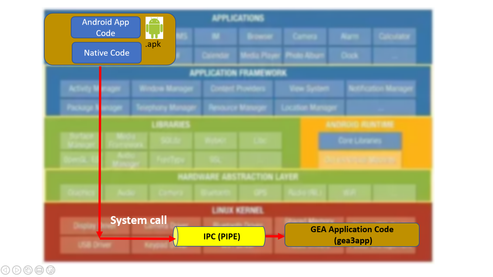

# Android POC Architecture

## Architecture 1 (Direct communication using NDK Layer)

* The Android application for GE appliance will be developed using Android SDK. This Android App will make use of Named Pipe(FIFO) to communicate with GEA Application.
This Pipe code in written as Native Code(C/C++)
Note: Android studio 3.4.1 and Android NDK tool is used fro developing Android Application
* Since Android App is written in Java / Kotlin hence system services provided by android cannot use APIs of Native Code (C/C++) directly. 
To solve this issue Android provides JNI and Android NDK which allow to use Native code API.
* GEA Application code implements GEA task/thread which initializes GEA Bus. GEA Application code also implements UART configuration code for GEA3 communication. This code implements API’s required by GE appliance common code library to send and receive data over UART. 
* GE appliance common code module which is provided by GE is written in Native language i.e. C. This module is common for all the appliances hence to provide interoperability and reusability, a static library is created using this code. This library is part of GEA Application code.

## Architecture 2 (Using Android Services and Service Manager)

